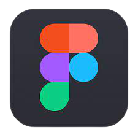

<h2 align="center"> Hi there!, I am <b>Arin Modi</b>
 </h2> 

  

###  About Me:

- :raising_hand_man:   I’m interested in <b>Cloud</b> and <b>New Technolgies</b> 

- :mortar_board:   I’m currently doing <b>B.Tech in Computer Engineering</b> 

- :eyes:   I’m looking to collaborate on <b>Software Enginnering</b> projects 

- 📫   You can contact me by my email <b>arinmodi2306@gmail.com</b>  

### :hammer_and_wrench: Technology & Tools :  

<table>

  <tr>
    <td align="center" width="96">
      
       Java
    </td>
    <td align="center" width="96">
      
       Kotlin
    </td>
    <td align="center" width="96">
      
       javaScript
    </td>
    <td align="center" width="96">
      
       Android
    </td>
    <td align="center" width="96">
      
       reactNative
    </td>
    <td align="center" width="96">
      
       Firebase
    </td>
    <td align="center" width="96">
      
       nodejs
    </td>
  </tr>
   <tr>
    <td align="center" width="96">
      
       MongoDB
    </td>
    <td align="center" width="96">
      
       SQLITE
    </td>
    <td align="center" width="96">
      
       MySql
    </td>
    <td align="center" width="96">
      
       Redux
    </td>
    <td align="center" width="96">
      
       VSCODE
    </td>
    <td align="center" width="96">
      
       Figma
    </td>
    <td align="center" width="96">
      
       Github
    </td>
  </tr>

</table>  

### 📱 Play Console : 

<h4><a href="https://play.google.com/store/apps/dev?id=6266890499801054784"> - My Play Console </a><h4/>
  

### :desktop_computer: Quick stats:  

<!---
arinmodi/arinmodi is a ✨ special ✨ repository because its `README.md` (this file) appears on your GitHub profile.
You can click the Preview link to take a look at your changes.
--->
